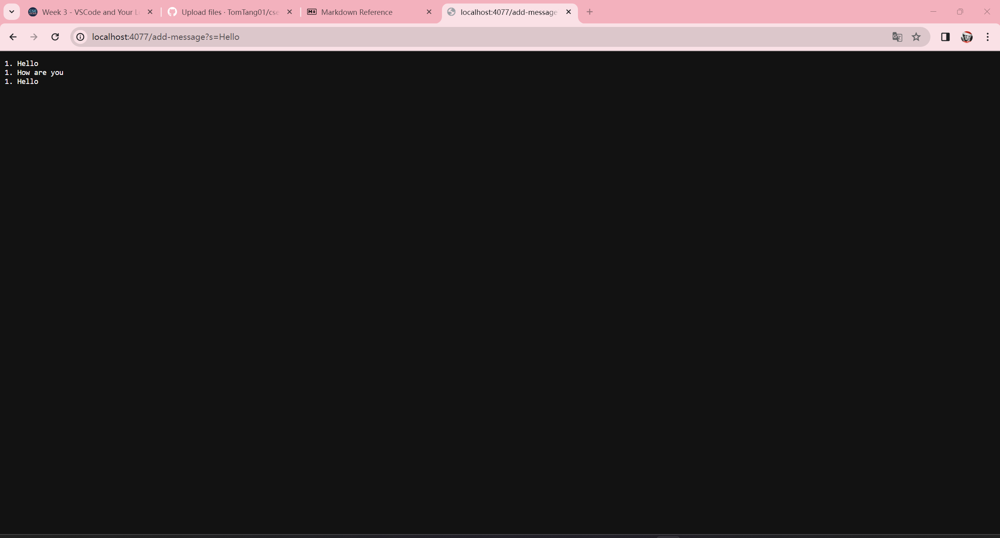
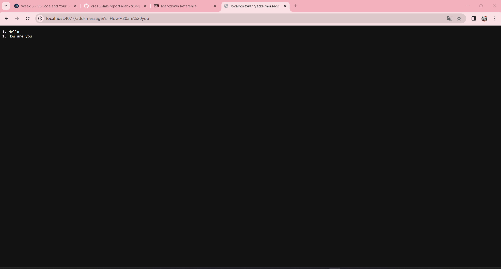
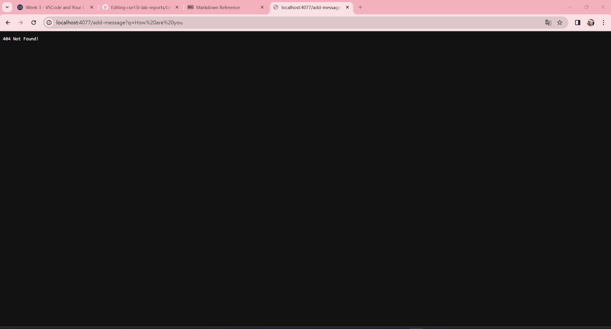

##  Code for `StringServer.java` :
```
import java.io.IOException;
import java.net.URI;

class Handler implements URLHandler {
    // The one bit of state on the server: a counter and a string that will be 
    // manipulated by various requests.
    
    String str = "";
    int num = 0;

    public String handleRequest(URI url) {
        if (url.getPath().equals("/")) {
            return String.format("%s", str);
        } else {
            if (url.getPath().contains("/add-message")) {
                String[] parameters = url.getQuery().split("=");
                if (parameters[0].equals("s")) {
                    num +=1;
                    str += num + ". " + parameters[1] + "\n";
                    return String.format("%s", str);
                }
            }
            return "404 Not Found!";
        }
    }
}

class StringServer {
    public static void main(String[] args) throws IOException {
        if(args.length == 0){
            System.out.println("Missing port number! Try any number between 1024 to 49151");
            return;
        }

        int port = Integer.parseInt(args[0]);

        Server.start(port, new Handler());
    }
}
```

##  Screenshots of using `/add-message` :


Both of these sceenshots succeeded so I am going to refer them together (The third one had a error message as output). Starting from the point where the user enters the url with the `/add-message`, the handleRequest method within the Handler class is called. It first checks if the path of the url is only the string "/" or not using the getPath() method and the equals() method. In these cases no, so it moves on to the next line, and excutes the else statement.In there it checks if the path contains the string "/add-message" using the getPath() and contains() methods. It passes and a String array is created to store 2 strings. One is the piece before the "=" and the other one is the piece after the "=". This is done by calling the getQuery() and split() methods. Then it uses the equals() method to check if the first string in the created array is "s" or not. In these cases yes. The instance variable num is incremented by 1 and the instance variable str, which stored the string we wanted to display, was added by the num variable, and string ". " and the second string in the array, all to the back of str. It then returns str and displays it on the page.

This one has a error message as output. Starting from the point where the user enters the url with the `/add-message`, the handleRequest method within the Handler class is called. It first checks if the path of the url is only the string "/" or not using the getPath() method and the equals() method. In this case no, so it moves on to the next line, and excutes the else statement.In there it checks if the path contains the string "/add-message" using the getPath() and contains() methods. It fails because the string before "=" is "q" not "s", so it jumps to the end of the method and returns "404 Not Found" and displays it on the page.
