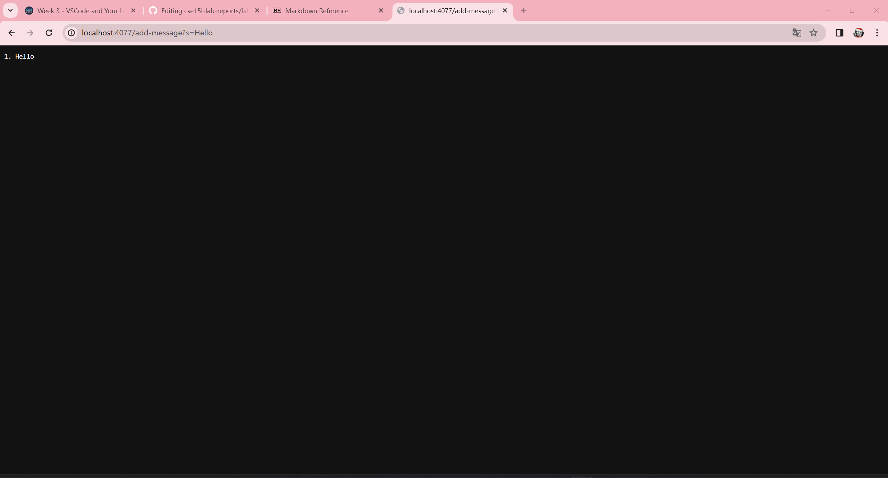
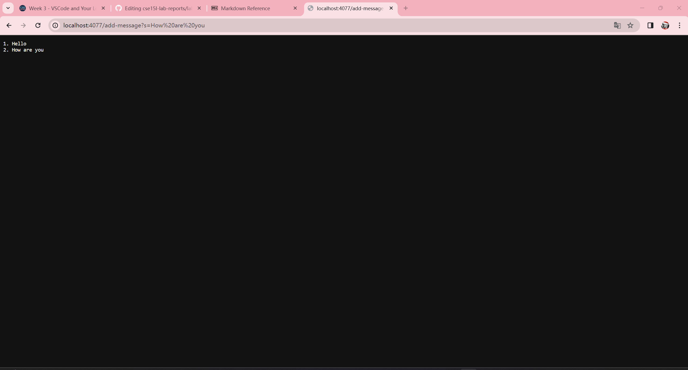
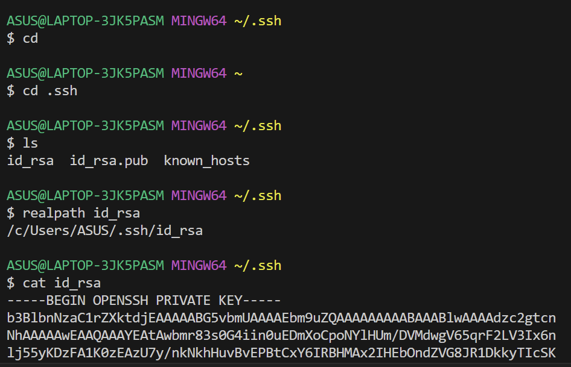
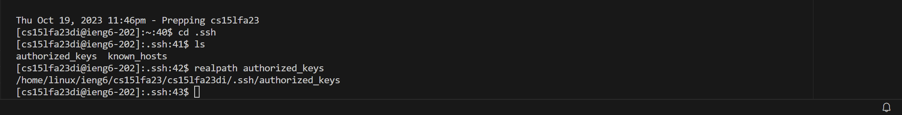
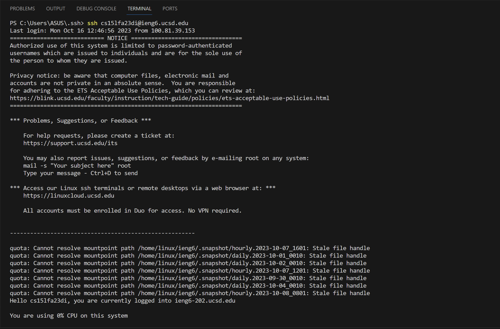

##  Code for `StringServer.java` :
```
import java.io.IOException;
import java.net.URI;

class Handler implements URLHandler {
    // The one bit of state on the server: a counter and a string that will be 
    // manipulated by various requests.
    
    String str = "";
    int num = 0;

    public String handleRequest(URI url) {
        if (url.getPath().equals("/")) {
            return String.format("%s", str);
        } else {
            if (url.getPath().contains("/add-message")) {
                String[] parameters = url.getQuery().split("=");
                if (parameters[0].equals("s")) {
                    num +=1;
                    str += num + ". " + parameters[1] + "\n";
                    return String.format("%s", str);
                }
            }
            return "404 Not Found!";
        }
    }
}

class StringServer {
    public static void main(String[] args) throws IOException {
        if(args.length == 0){
            System.out.println("Missing port number! Try any number between 1024 to 49151");
            return;
        }

        int port = Integer.parseInt(args[0]);

        Server.start(port, new Handler());
    }
}
```

##  Screenshots of using `/add-message` :

Starting from the point where the user enters the url with the `/add-message`, the `handleRequest` method within the `Handler` class is called. It first checks if the path of the url is only the string "/" or not using the `getPath()` method and the `equals()` method. In this case no, so it moves on to the next line, and excutes the else statement.In there it checks if the path contains the string "/add-message" using the `getPath()` and `contains()` methods. It passes and a String array is created to store 2 strings. One is the piece before the "=" and the other one is the piece after the "=". This is done by calling the `getQuery()` and `split()` methods. Then it uses the `equals()` method to check if the first string in the created array is "s" or not. In this case yes. The instance variable `num` is incremented from 0 to 1, and the instance variable `str`, which stored the string we wanted to display (currently empty), was added by the num variable, and string ". ", the second string in the array which is "Hello", and the string "\n" which means start a new line, all to the back of `str`. The variable `str` now is "1. Hello\n". At last, str is returned by the method and displayed on the page: 
1. Hello


Starting from the point where the user enters the url with the `/add-message`, the `handleRequest` method within the `Handler` class is called. It first checks if the path of the url is only the string "/" or not using the `getPath()` method and the `equals()` method. In this case no, so it moves on to the next line, and excutes the else statement.In there it checks if the path contains the string "/add-message" using the `getPath()` and `contains()` methods. It passes and a String array is created to store 2 strings. One is the piece before the "=" and the other one is the piece after the "=". This is done by calling the `getQuery()` and `split()` methods. Then it uses the `equals()` method to check if the first string in the created array is "s" or not. In this case yes. The instance variable `num` is incremented from 1 to 2, and the instance variable `str` was appended with the num variable, and string ". ", the second string in the array which is "How are you", and the string "\n". The variable `str` is now "1. Hello\n2. How are you\n". It is is returned by the method and displayed on the page: 
1. Hello
2. How are you

##  Screenshot of the path to the *private* key for my SSH key for logging into `ieng6`:


##  Screenshot of the path to the *public* key for my SSH key for logging into `ieng6`:


##  Screenshot of terminal interaction where I logged into `ieng6` with my course-specific account without being asked for a password:


##  Something I did not know before lab 2&3:
I did not know that java had a built in URI package. I always thought that a server can only be created by some kind of registration on the internet and never thought that java can easily create simple servers. And of course I did not know how the URLs of websites worked ; did not know that URLs are made up of the domain, the path, the query, and the anchor.
