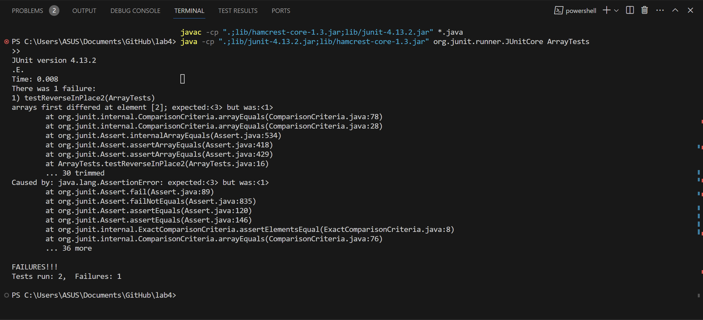

#  Lab Report 3

##  Bugs
The error I choose was from the ArrayExamples class.
A failure-inducing input would be:
```
@Test 
public void testReverseInPlace2() {
    int[] input1 = { 3,2,1 };
    ArrayExamples.reverseInPlace(input1);
    assertArrayEquals(new int[]{ 1,2,3 }, input1);
}
```
An input that does not fail would be:
```

@Test 
public void testReverseInPlace() {
    int[] input1 = { 3 };
    ArrayExamples.reverseInPlace(input1);
    assertArrayEquals(new int[]{ 3 }, input1);
}
```
The symptom of the failure-inducing input that the element of index 2 of the actual output of the testReverseInPlace2 method is 3 when it should be 1. Here is the screenshot:

The part of the code containing the bug:
```
static void reverseInPlace(int[] arr) {
    for(int i = 0; i < arr.length; i += 1) {
        arr[i] = arr[arr.length - i - 1];
    }
}
```
A reason why we are not getting the expected output is that the reverseInPlace method loops through the whole array. This means that even if we assume that it does swap elements, it swaps them twice hence no swap at all. In fact, the replaceInPlace method fails to swap the elements. It merely copies the element from the back and use them to replace the elements in the front half. To fix it we need to divide the arr.length in the condition statement in the for loop by 2 and create a new int variable to store the current arr[i] before copying arr[arr.length - i - 1] to arr[i]. Then copy the value in current to arr[arr.length - i - 1]. The code after the fix is:
```
static void reverseInPlace(int[] arr) {
    for(int i = 0; i < arr.length/2; i += 1) {
        int temp = arr[i];
        arr[i] = arr[arr.length - i - 1];
        arr[arr.length - i - 1] = temp;
    }
}
```
---

##  Researching Commands
The command I chose is `grep`. All information is taken from the man grep page [https://linuxcommand.org/lc3_man_pages/grep1.html](https://linuxcommand.org/lc3_man_pages/grep1.html). 4 command-line options of grep:
* -i : Ignore uppercase lowercase
    * Ignore case distinctions. It will find all the lines of all the files (with satisfying path pattern) with the string with any of the letters in upper or lowercase.
    * Examples:

```
ASUS@LAPTOP-3JK5PASM MINGW64 /d/UCSD/15l/lab5/docsearch (main)
$ grep -i "tHIs rna" technical/biomed/*.txt
technical/biomed/1471-2105-3-18.txt:        permitting noncanonical base pairs. This RNA structural
technical/biomed/1471-2105-3-2.txt:            1.00, greater than the minimum value for this RNA and
technical/biomed/1471-2105-3-2.txt:            This RNA sequence/structure query system has three
technical/biomed/1471-2164-3-26.txt:        Preliminary evidence indicates that this RNase III
technical/biomed/1471-2180-1-12.txt:          contains DR2, DR1, and the 5' half of ∈. This RNA was
technical/biomed/1471-2199-2-6.txt:        are shown in Figure 1. This RNA hairpin makes contacts with
technical/biomed/1471-2407-1-15.txt:        functional link between this RNA binding protein and hERα
technical/biomed/gb-2002-3-8-research0038.txt:          amplification of approximately 1,000 fold. This RNA was

```
```
ASUS@LAPTOP-3JK5PASM MINGW64 /d/UCSD/15l/lab5/docsearch (main)
$ grep -i "dna" technical/plos/pmed.0020103.txt
          Total RNA was prepared by using TRIZOL (Invitrogen) and RQ1 RNase-free DNase (Promega,
          Madison, Wisconsin, United States). For cDNA synthesis, random sequence primers were used
          Taq High Fidelity DNA Polymerase (Invitrogen). GAPDH expression was
          used to normalize input template cDNA to analyze relative gene expression. Primer
          DNA products from PCR reactions were excised, cloned, and sequenced.
          We used human insulin cDNA (320 bp) cloned in plasmid pCR4-TOPO (Invitrogen) as a
          Hoxc6 (NM_004503), human insulin cDNA (J00265),

```

* -v : Invert match
    * Invert the sense of matching, returns all of the non-matching lines of all the files that have a path that satisfies the pattern.
    * Examples:

```
ASUS@LAPTOP-3JK5PASM MINGW64 /d/UCSD/15l/lab5/docsearch (main)
$ grep -v " " technical/government/Media/Hard_to_Get.txt


maintenance.
well.


```
```
ASUS@LAPTOP-3JK5PASM MINGW64 /d/UCSD/15l/lab5/docsearch (main)
$ grep -v "," technical/government/Media/Hard_to_Get.txt


Justice is Hard to Get When You Can't Afford a Lawyer
F. Dianne Taylor
COMMENTARY F. Dianne Taylor is executive director of Legal
Services of Eastern Missouri.
sounds in the movies. It includes the statement: "You have the
right to speak to an attorney and to have an attorney present
provided for you at government expense."
problems that can afflict people in any walk of life?
U.S. Supreme Court Justice Ruth Bader Ginsburg has estimated
that four out of every five low-income people in America who need
legal representation don't receive it. That is a sobering
help are denied such guidance and counsel.
Who are these people? They may be victims of domestic abuse.
Perhaps they are elderly people who are swindled out of their life
savings or beaten by a neighbor or acquaintance. Maybe they are
homeless children who can't attend school because they aren't
officially residents of a district.
eviction or physical assault or bankruptcy without legal assistance
can be every bit as frightening as standing trial on a criminal
maintenance.
the 21 counties our not-for-profit organization represents. By
counties stretching from the Iowa border to Jefferson County
1990. With the increase in unemployment and the gradual decline of
the legal help they need.
Legal Services of Eastern Missouri does receive the valuable
now offer legal assistance for specific problems:
Legal Services' Lasting Solutions Project provides a holistic
approach to the many issues that affect families experiencing
domestic violence.
Its MC+ Project helps people who are enrolled in the Medicaid
Managed Care program but have been unable to access the health care
to which they are entitled.
shelters and outreach clinics.
The AIDS Project provides legal assistance for people living
with HIV or AIDS.
And the Immigration Law Project assists people at proceedings on
and deportation and exclusion hearings.
sources could increase the number of legal professional we could
community would bring invaluable expertise and guidance as
well.
Civil cases may not be fodder for a hot new movie. They are
marks a victory not just for the client but for our entire
way of life as well as a doctrine.


```

* -l : --files-with-matches
    * Prints out the file names of the all the files that have path satisfying the pattern that contain the given string.
    * Examples:

```
ASUS@LAPTOP-3JK5PASM MINGW64 /d/UCSD/15l/lab5/docsearch (main)
$ grep -l "false" technical/911report/*.txt
technical/911report/chapter-10.txt
technical/911report/chapter-12.txt
technical/911report/chapter-13.4.txt
technical/911report/chapter-13.5.txt
technical/911report/chapter-2.txt
technical/911report/chapter-3.txt
technical/911report/chapter-6.txt
technical/911report/chapter-7.txt
technical/911report/chapter-9.txt

```
```
ASUS@LAPTOP-3JK5PASM MINGW64 /d/UCSD/15l/lab5/docsearch (main)
$ grep -l "not cured" technical/biomed/*.txt
technical/biomed/1471-2466-2-4.txt

```

* -r : --recursive
    * Lists all the lines of all the files within the path directory with the correct pattern that contain the given string.
    * Examples:

```
ASUS@LAPTOP-3JK5PASM MINGW64 /d/UCSD/15l/lab5/docsearch (main)
$ grep -r "false" technical/plos/pmed.0020059.txt
        more false signals than the nominal statistical significance level would indicate.
        promotions or the allergy season could hide a true signal or create a false signal for the
          on average expect one false alarm every 20 d for each syndrome under surveillance.
          is worth noting that at the false alarm rate chosen, none of the residential signals
        disease outbreaks, then the method generated at most two false alarms at a signal threshold
        weeks of data, we would get less variability in the expected counts and fewer false
        a number of false alarms, and highlights the need for systematic data quality checks and
```
```
ASUS@LAPTOP-3JK5PASM MINGW64 /d/UCSD/15l/lab5/docsearch (main)
$ grep -r "false" technical/911report
technical/911report/chapter-10.txt:                of unnerving false alarms, Air Force One flew to Barksdale Air Force Base in
technical/911report/chapter-12.txt:                consequence was that bags, not people, were checked. Competing risks include "false
technical/911report/chapter-12.txt:                helps protect the other. The choice between security and liberty is a false choice,
technical/911report/chapter-13.4.txt:            44. For Khallad's visa application under a false name and its rejection, see DOS
technical/911report/chapter-13.5.txt:                12, 2000 (online at www.nycop.com). For the general false impression, see Civilian
technical/911report/chapter-13.5.txt:                been proved false by U.S. government records (Hani Hanjour, Saeed al Ghamdi, and
technical/911report/chapter-2.txt:                legislation, only prove these rulers to be false Muslims usurping God's authority
technical/911report/chapter-3.txt:                advocating terrorist action against the United States, and false identification
technical/911report/chapter-3.txt:            This responsibility gives many the false impression that the DCI has line authority
technical/911report/chapter-6.txt:                $12,000. Back in Canada, he went about procuring weapons, chemicals, and false
technical/911report/chapter-6.txt:                from France to Montreal using a photo-substituted French passport under a false
technical/911report/chapter-6.txt:                the same false name as his passport. As that agent began an initial pat-down, Ressam
technical/911report/chapter-7.txt:                or erase entry and exit stamps to create "false trails" in the passports.
technical/911report/chapter-7.txt:                published reports, there is no evidence the hijackers ever used false Social
technical/911report/chapter-9.txt:                civilians who worked in the Twin Towers with the false impression that helicopter
technical/911report/chapter-9.txt:                either because of a false report of a third plane approaching or because of his

```
References:
[https://linuxcommand.org/lc3_man_pages/grep1.html](https://linuxcommand.org/lc3_man_pages/grep1.html)
