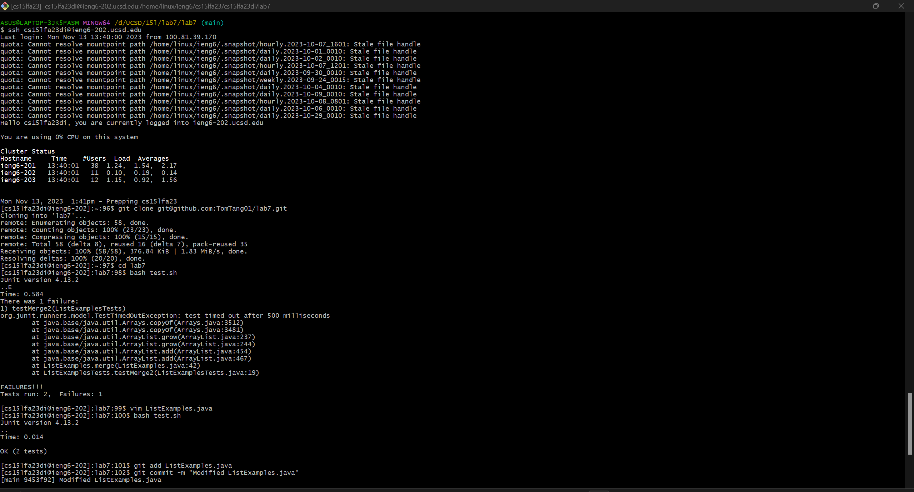
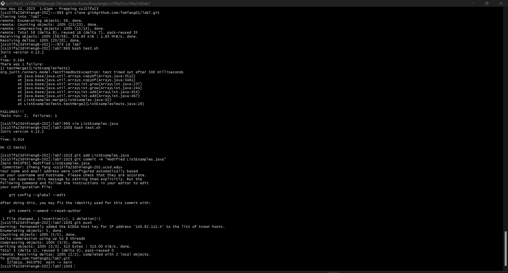

#  Labreport4
##  Tom Tang
Sreenshot of step 4 through step 9:

## Keys pressed for each step:

**Step 4:** Keys pressed: *`<up>` `<enter>`*. This was the last command I entered before logging into the server so it is the most previous command in my bash history. Thus I can use the *`<up>`* arrow to access it.

**Step 5:** Keys pressed: *`git` `<spacebar>` `clone` `<spacebar>` `<ctrl>+v` `<enter>`*. I copied the ssh URL link to my repository using *`<ctrl>+c`* so now I can just copy and paste it it to the bash prompt.

**Step 6:** Keys pressed: *`cd` `<spacebar>` `la` `<tab>` `<enter>` `bash` `<spacebar>` `tes` `<tab>` `<enter>`*. I first changed directory into lab7 then called on the `test.sh` file. I used *`<tab>`* because it prevents typos. There was only one firectry starting with "la" in the home directory and there was only one file starting with "tes" in the lab7 directory. So it was safe to use `<tab>`

**Step 7 part 1:** Keys pressed: *`vim` `<spacebar>` `<shift>+l` `is` `<tab>` `.java` `<enter>`*. I used *`<tab>`* to finish `ListExamples.java` because the file name is long and this can prevent typos. It did not finish the file name because there is another file called `ListExamplesTests.java` in the same directory and it does not know which one I want. Thus it stopped at `ListExamples` and waited for me to finish or give it more information. I chose to enter the rest of the name manually becasue it was not very long. Now the file is open in vim.

**Step 7 part 2:** Keys pressed: *`i` `<backspace>` `2` `<esc>` `<shift>+;` `wq` `<enter>`*. I don't know why but my curser was already behind the `index1` that we have to change. I think it is because the person who last changed the repository before I forked it left the cursor at that location. If the cursor started at the top left, then I would have to press `j` 43 times and then `l` 12 times to get to the back of `index1`. Then I went in insert mode using `i` and corrected the method, then returned to normal mode i=using `<esc>` and saved and exited the file using `:wq`.

**Step 8:** Keys pressed: *`<up>` `<up>` `<enter>`*. `bash test.sh` was the command before the previous command in the bash history so I can access it by just pressing `<up>` twice.

**Step 9 part 1:** Keys pressed: *`git` `<spacebar>` `add` `<spacebar>` `<shift>+l` `is` `<tab>` `<enter>`*. I used `<tab>` becasue git knows from my current git status that the only file that starts with "Lis" that has been changed and not staged is `ListExamples.java`.

**Step 9 part 2:** Keys pressed: *`git` `<spacebar>` `commit` `<spacebar>` `-m` `<spacebar>` `<shift>+'` `<shift>+l` `ist` `<shift>+E` `xamples.java` `<spacebar>` `modified` `<shift>+'` `<enter>`*. Commit with a message.

**Step 9 part 3:** Keys pressed: *`git` `<spacebar>` `push` `<enter>`*. Push to my git repository.
